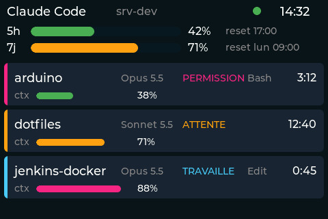

# Claude_Dashboard — JC3248W535C

Tableau de bord Claude Code sur l'écran 3.5" (480×320, paysage) du JC3248W535C :
quotas du forfait, et état de chaque session Claude Code qui tourne sur un ou
plusieurs serveurs Linux distants. L'écran bipe et se rallume quand une session
attend une réponse ou une permission.

Ce README couvre le firmware et la mise en place d'ensemble. L'agent serveur
(installation, hooks, statusline, configuration) est documenté dans
[`server/README.md`](server/README.md).

## Architecture

```
Serveur Linux (un ou plusieurs)                  Scaleway IoT Hub        Maison
┌───────────────────────────────────────┐        (plan Shared)
│ Claude Code (N sessions)              │
│  ├─ hooks ──────┐                     │
│  └─ statusline ─┤ écrivent            │
│                 ▼                     │
│  ~/.claude/dashboard/sessions/*.json  │
│                 │ scruté chaque s     │
│                 ▼                     │   mTLS 8883            mTLS 8883
│  claude-dash-agent (systemd --user) ──┼──► claude-dash/ ─────► JC3248W535C
│   device "serveur" (1 par serveur)    │    <host>/state       device "ecran"
└───────────────────────────────────────┘    (QoS 1, sans        (abonné QoS 0)
                                              retain)
```

- **Agent** (`server/`) : agrège les sessions, purge celles dont le processus
  `claude` est mort, publie un snapshot JSON sur `claude-dash/<hostname>/state` à
  chaque changement (au plus toutes les 2 s) et au moins toutes les 20 s
  (heartbeat : le plan Shared ne garde aucun message retained). À l'arrêt propre
  (SIGTERM, `systemctl --user stop`), il publie un message vide : l'écran retire
  aussitôt le serveur.
- **Broker** : Scaleway IoT Hub, plan Shared (gratuit). Chaque client
  s'authentifie par certificat (mTLS) ; le client id MQTT est le Device ID.
- **Firmware** : WiFi, NTP, MQTT/TLS (PubSubClient + `NetworkClientSecure`), LVGL
  8.4, bip I2S. La logique (parsing, agrégation multi-hôte, tri, transitions,
  péremption, veille) vit dans `lib/dash_model/`, sans Arduino ni LVGL, et est
  testée en natif.

## Ce que montre l'écran



*Rendu de `src/ui.cpp` par LVGL 8.4 sur PC, avec des sessions fictives.*

```
┌────────────────────────────────────────────────────────────┐
│ Claude Code         srv-dev                  ●    14:32    │  en-tête
│ 5h  ███████████░░░░░░░░░░░░░░░░  42%    reset 17:00        │  quotas
│ 7j  ███████████████████░░░░░░░░  71%    reset lun 09:00    │
│ ┃ arduino             Opus 5.5   PERMISSION  Bash    3:12  │  cartes
│ ┃ ctx ██████░░░░░░░░░░░  38%                               │  (défilables)
│ ┃ dotfiles            Sonnet 5.5 ATTENTE            12:40  │
│ ┃ ctx ████████████░░░░░  71%                               │
└────────────────────────────────────────────────────────────┘
```

- **En-tête** : nom du serveur (s'il n'y en a qu'un), pastille MQTT (verte =
  connecté, rouge = déconnecté), heure locale (Europe/Paris).
- **Quotas 5h / 7j** : pourcentage utilisé et heure de remise à zéro, pris dans
  le snapshot le plus récent qui en contient (fournis par la statusline).
  « -- » tant qu'inconnus.
- **Cartes** (une par session), triées par urgence : `PERMISSION` > `ATTENTE` >
  `TRAVAILLE`, puis de la plus ancienne à la plus récente. Chaque carte : projet
  (`projet@hôte` si plusieurs serveurs), modèle, état, outil en cours, durée dans
  l'état, jauge de contexte. Au plus 16 cartes, puis « +N autres sessions ».
- **Couleurs** : liseré et état rose = permission, orange = attente, bleu =
  travaille. Jauges : vert < 60 %, orange < 85 %, rose au-delà.
- **Messages** : « En attente de donnees... » tant qu'aucun serveur n'a publié
  (jusqu'à 20 s après le démarrage), « Aucune session active » ensuite.
- **Bandeau rose « Serveur injoignable depuis N min »** et liste estompée quand
  le dernier snapshot a plus de 180 s (calculé depuis son horodatage `ts`).
- **Serveur oublié après 1 h sans nouvelles** (agent planté, coupure réseau,
  serveur en veille) : ses cartes et le bandeau disparaissent (`Hote oublie apres
  1 h sans nouvelles` sur le port série), et l'écran peut se mettre en veille
  10 min plus tard. Un arrêt propre de l'agent le retire immédiatement (message
  vide). 4 serveurs et 12 sessions par serveur au plus. Un serveur qui revient est
  traité comme nouveau (pas de bip).
- **Bips** (NS4168, volume `BEEP_VOLUME` = 35 %) sur un changement d'état d'une
  session déjà connue : deux bips aigus pour `permission`, un bip grave pour
  `attente`. Pas de bip au démarrage, au premier snapshot d'un serveur, ni au
  retour d'un serveur qui était périmé.
- **Veille** : écran allumé tant qu'au moins une session est listée (tout état,
  tout serveur, même périmée). Sans session, extinction après 10 min sans
  activité (toucher, alerte, disparition de la dernière session). Un toucher ou
  une alerte le rallume.

## Prérequis

### Matériel et outils

- JC3248W535C branché en USB (port `/dev/ttyACM0`, USB CDC natif) ;
- PlatformIO (`~/.platformio/penv/bin/pio`, noté `$PIO` ci-dessous) ; la
  plateforme pioarduino et les bibliothèques (`lib_deps` : LVGL 8.4,
  ArduinoJson 7, PubSubClient 2.8) sont téléchargées au premier build ;
- `openssl` pour vérifier les certificats (facultatif mais recommandé).

### Scaleway IoT Hub (plan Shared)

Dans la console Scaleway, **IoT Hub** :

1. Crée un hub, plan **Shared**. Note le nom d'hôte MQTT (page d'aperçu,
   par ex. `iot.fr-par.scw.cloud`) et télécharge le **certificat CA du hub**.
2. Crée les devices, un par client connecté (un Device ID = un seul client à
   la fois) :

   | Device | Rôle | Publish | Subscribe |
   |---|---|---|---|
   | `serveur` (**un par serveur**) | agent | accept `claude-dash/<hostname>/#` | reject `#` |
   | `ecran` | firmware | reject `#` | accept `claude-dash/#` |
   | `debug` (facultatif) | `mosquitto_sub` de test | reject `#` | accept `claude-dash/#` |

   Les filtres de messages (policy accept/reject + topics) remplacent les ACL :
   un certificat serveur volé ne peut publier que sur son propre `<hostname>`,
   celui de l'écran ne peut rien publier. `<hostname>` est le nom publié par
   l'agent (`[agent] hostname` dans sa config, sinon le nom court de la
   machine).
3. Pour chaque device, télécharge **certificat et clé privée** à la création
   (Scaleway ne les redonne pas : en cas de perte, renouvelle le certificat).
   Note le **Device ID** (UUID) : c'est le client id MQTT obligatoire.

Le plan Shared est sans état : ni message retained, ni session persistante, ni
QoS 2 ; l'écran s'abonne en QoS 0. D'où le heartbeat de 20 s de l'agent.

## `credentials.h`

Le firmware lit `src/credentials.h`, lien symbolique (non versionné, ignoré par
git) vers le fichier commun du dépôt. Le lien doit être **absolu** :

```bash
ln -s /chemin/absolu/vers/arduino/sketches/common/credentials.h src/credentials.h
```

Modèle : [`sketches/common/credentials.h.example`](../../common/credentials.h.example).
Macros requises (un `#error` explicite nomme celle qui manque) :

| Macro | Contenu |
|---|---|
| `WIFI_SSID`, `WIFI_PASSWORD` | réseau WiFi 2.4 GHz |
| `WIFI_SSID_2`…`_4`, `WIFI_PASSWORD_2`…`_4` | *optionnel* : réseaux d'autres sites |
| `DASH_MQTT_SERVER` | nom d'hôte du hub |
| `DASH_MQTT_PORT` | `8883` |
| `DASH_MQTT_CLIENT_ID` | Device ID (UUID) du device `ecran` |
| `DASH_MQTT_CA_CERT` | certificat CA du hub (PEM) |
| `DASH_MQTT_CLIENT_CERT` | certificat du device `ecran` (PEM) |
| `DASH_MQTT_CLIENT_KEY` | clé privée du device `ecran` (PEM, **non chiffrée**) |

**Plusieurs sites.** Pour déplacer l'écran d'un site à l'autre, on déclare
jusqu'à 4 réseaux (`WIFI_SSID` puis `WIFI_SSID_2`…`_4`, chacun avec son mot de
passe). Au démarrage, et après 30 s sans WiFi, l'écran lance un scan
asynchrone et se connecte au **premier réseau déclaré qui est visible**. C'est
l'ordre de déclaration qui fixe la priorité, pas la force du signal. Avec un
seul réseau, pas de scan : `WiFi.begin()` direct, ce qui marche aussi pour un
SSID caché. Avec plusieurs, un SSID caché n'apparaît pas au scan et ne peut
donc pas être choisi. Série : `Scan WiFi...`, `Reseau connu trouve : <ssid>`
ou `Aucun reseau connu parmi N visibles` (nouvel essai 30 s plus tard).

### Conversion des PEM : `tools/pem2credentials.sh`

Chaque PEM doit devenir une chaîne C multiligne, une ligne par ligne du fichier,
terminée par `\n`. Le script le fait et vérifie les fichiers au passage :

```bash
tools/pem2credentials.sh iot-hub-ca.pem ecran.crt ecran.key > /dev/null   # vérifier seulement
tools/pem2credentials.sh iot-hub-ca.pem ecran.crt ecran.key bloc.h        # écrire (chmod 600)
```

- sans 4e argument, le bloc va sur la sortie standard (messages sur stderr) ;
  avec, le fichier est créé en `chmod 600` ;
- fins de ligne Windows (CRLF) et lignes vides retirées (un `\r` dans la chaîne
  fait échouer mbedTLS : « BASE64 - Invalid character ») ;
- avec `openssl` : certificats et clé valides, clé non chiffrée (sinon la
  commande de déchiffrement est proposée), clé correspondant au certificat ;
  sujets et dates d'expiration affichés.

Remplace ensuite les trois blocs `DASH_MQTT_*_CERT/KEY` de `credentials.h` par le
contenu de `bloc.h`, puis `shred -u bloc.h` (il contient la clé privée).

Équivalent manuel, pour un fichier :

```bash
echo '#define DASH_MQTT_CA_CERT \'
sed 's/\r$//; /^[[:space:]]*$/d' iot-hub-ca.pem | sed 's/.*/    "&\\n" \\/' | sed '$ s/ \\$//'
```

## Compiler, flasher, observer

```bash
cd sketches/JC3248W535C/Claude_Dashboard
PIO=~/.platformio/penv/bin/pio
$PIO run -e esp32s3                 # compiler
$PIO run -e esp32s3 -t upload       # flasher (/dev/ttyACM0)
$PIO device monitor -e esp32s3      # moniteur série (115200)
```

Le moniteur a besoin d'un terminal (tty). Pour une capture non interactive,
toujours bornée dans le temps (jamais d'accès direct au port série, cf.
`CLAUDE.md`) :

```bash
timeout 40 script -qfc "$PIO device monitor -e esp32s3" capture.log < /dev/null
```

Démarrage normal : `WiFi connecte a <ssid>, IP ...`, `NTP synchronise : ...`,
`MQTT connecte en ... ms (client xxxxxxxx...)`, `[TLS connecte] heap interne ...`,
`Abonne a claude-dash/+/state (QoS 0) ...`, puis les cartes au premier
heartbeat (≤ heartbeat de l'agent, 20 s par défaut).

Délai de veille court pour les essais :
`PLATFORMIO_BUILD_FLAGS="-DSCREEN_TIMEOUT_MS=45000UL" $PIO run -e esp32s3 -t upload`
(reflasher ensuite sans la variable).

## Tests et qualité

```bash
$PIO test -e native                     # dash_model : 62 tests Unity sur le PC
$PIO check -e esp32s3 --skip-packages   # cppcheck sur main.cpp, ui.cpp, beep.cpp, dash_model
server/run-checks.sh                    # agent : ruff, mypy, pytest (Docker)
server/dev/integration-test.sh          # agent + Mosquitto local (Docker)
server/dev/integration-test-mtls.sh     # idem en mTLS sans retained (imite Scaleway)
server/dev/test-install.sh              # install.sh dans un conteneur jetable
```

`pio check` signale des défauts dans LVGL, ArduinoJson et `include/` (code
tiers) : seuls nos fichiers doivent être à zéro.

## Dépannage

Lire d'abord le moniteur série : chaque échec y est expliqué.

| Symptôme (série / écran) | Cause probable |
|---|---|
| `#error "credentials.h : ... manquant"` à la compilation | macro absente, ou lien `src/credentials.h` cassé / relatif |
| `ERREUR credentials.h : DASH_MQTT_... invalide (mbedTLS -0x....), MQTT desactive` (répété toutes les 60 s) | PEM mal converti (CRLF, ligne manquante, `\n` oublié) ou clé chiffrée : repasser par `tools/pem2credentials.sh` |
| `Attention credentials.h : ..., N certificat(s) ignore(s)` | un bloc du PEM est illisible mais au moins un certificat a été lu : sans gravité si la connexion passe |
| Pastille rouge, pas de ligne MQTT | WiFi absent, ou heure pas encore valide (NTP) : MQTT n'est tenté qu'avec une heure > 2024, nécessaire pour vérifier le certificat |
| `MQTT echec rc=-2 ... (TLS -xxxx : texte)` | TCP/TLS : lire le texte mbedTLS. Certificat CA du hub, certificat/clé du device `ecran`, heure de la carte, nom d'hôte du hub |
| `MQTT echec rc=-4` | pas de CONNACK dans les 5 s : hub lent ou injoignable |
| `MQTT echec rc=5` (non autorisé) | Device ID ≠ celui du certificat, device désactivé, ou filtres de messages |
| `MQTT : echec DNS du broker` | DNS du réseau local ; `DASH_MQTT_SERVER` erroné |
| `MQTT : echec abonnement, deconnexion` | filtre Subscribe du device `ecran` (doit accepter `claude-dash/#`) |
| Connexions/déconnexions en boucle toutes les quelques secondes | **deux clients avec le même Device ID** (un `mosquitto_sub` de test avec l'identité de l'écran, deux écrans flashés pareil, deux serveurs sur le même device) : ils s'éjectent mutuellement. Un device par client ; `debug` pour les tests |
| « En attente de donnees... » indéfiniment, pastille verte | agent arrêté (`journalctl --user -u claude-dash-agent -f` sur le serveur) ou filtre Publish du device `serveur` qui ne couvre pas `claude-dash/<son hostname>/#` |
| `Snapshot ignore : host "x" different du topic ...` | `host` du JSON ≠ topic : agent mal configuré ou tentative d'usurpation |
| **Aucun bip, ou bandeau « Serveur injoignable » permanent alors que les données arrivent** | horloge du serveur décalée : l'âge d'un snapshot est calculé depuis son `ts`. La carte le signale (`Attention : horloge decalee de N s avec <host> (verifier NTP sur le serveur)`). Vérifier `timedatectl` sur le serveur (`System clock synchronized: yes`) |
| `Snapshot invalide sur ...` | JSON illisible ou sans `host` (un message > 4096 o, taille du tampon MQTT, est écarté sans message par PubSubClient) |
| `ERREUR : tampon MQTT de 4096 o non alloue` | mémoire interne insuffisante au démarrage |
| Panic / redémarrage `task_wdt` | boucle bloquée > 30 s (le watchdog est reconfiguré de 5 à 30 s au démarrage ; `WDT : configuration echouee` sinon) |
| `I2S : echec init, bips desactives` | I2S indisponible : l'écran fonctionne sans bips |

**Mémoire** : à la première connexion TLS, la carte affiche
`[TLS connecte] heap interne libre=... min=... | psram libre=...`. Le handshake
mTLS consomme de la RAM interne (hors PSRAM) : note ces valeurs quand tout
marche ; un minimum qui s'effondre (quelques Ko) accompagne les erreurs
d'allocation TLS (`MQTT echec rc=-2 ... (TLS -32512 : SSL - Memory allocation failed)`).

## Fichiers

| Chemin | Rôle |
|---|---|
| `src/main.cpp` | WiFi, NTP, MQTT/TLS, watchdog, alertes, veille |
| `src/ui.cpp` | interface LVGL (en-tête, quotas, cartes, bandeau) |
| `src/beep.cpp` | bips I2S (NS4168) |
| `lib/dash_model/` | modèle pur : parsing, agrégation, tri, transitions, helpers |
| `test/` | tests natifs Unity |
| `tools/pem2credentials.sh` | conversion PEM → bloc `credentials.h` |
| `src/esp_bsp.c`, `src/lv_port.c`, `src/esp_lcd_*.c`, `include/` | pilotes écran/tactile (repris de NorthernMan54/JC3248W535EN) |
| `server/` | agent Python, voir [`server/README.md`](server/README.md) |
